# 

- [Qué es Zahorí](#qué-es-zahorí)
- [Cómo funciona](#cómo-funciona)
- [Quiero probar Zahorí, ¿por donde empiezo?](#quiero-probar-zahorí-por-donde-empiezo)
- [Configura el entorno de desarrollo](#configura-el-entorno-de-desarrollo)

## Qué es Zahorí

Zahorí es una plataforma open source (licencia AGPLv3) para automatizar procesos, pruebas de software, o cualquier tarea manual que se realice repetidamente en un ordenador o un sistema software. 

Los ámbitos de aplicación principales se centran en el mundo RPA y en las pruebas de software automáticas (pruebas web end to end, pruebas de APIs, etc).

Zahorí se puede ejecutar tanto en sistemas Windows, Linux o Mac.

## Cómo funciona
Zahorí se compone de dos partes diferenciadas: los **procesos automatizados** y el **servidor**.

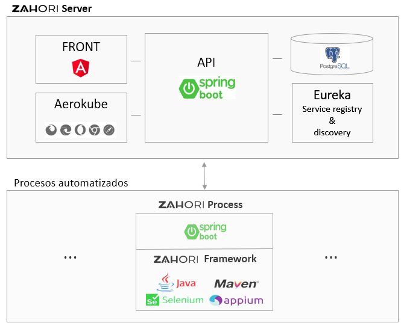

### Los procesos automatizados
Son proyectos desarrollados con Java donde vamos a implementar los procesos o pruebas repetitivas que queremos automatizar.

Estos proyectos hacen uso del **framework de zahorí** para comunicarse con el servidor, generar evidencias de forma automática (logs, capturas de pantalla, documentos, vídeos y ficheros HAR), proporcinar facilidades para automatizar distintos tipos de procesos, utilidades para leer y escribir distintos tipos de ficheros, conexiones con bases de datos, utilidades de red, etc...

En definitiva, el framework de zahorí es la librería principal del proyecto que nos ayudará a implementar nuestras automatizaciones.

### El servidor
Proporciona funcionalidades adicionales a los procesos automatizados, como por ejemplo: ejecución remota del proceso, almacén de los resultados y evidencias de las ejecuciones, definición de casos y datos, paralelización de ejecuciones en múltiples navegadores, etc.

El servidor se compone de:
- Un **frontal web** desarrollado en Angular donde podemos definir nuestros casos y datos de prueba, ejecutarlos, y ver los resultados y evidencias de esas ejecuciones.
- Una **base de datos** PostgreSQL donde se guarda toda la información.
- **Aerokube/Selenoid**: herramienta para ejecutar los procesos en múltiples navegadores en paralelo.
- **Eureka**: servidor donde se registran los procesos y el servidor al iniciarse para que se puedan comunicar entre ellos independientemente del número de instancias de cada uno, sus IPs y puertos.
- [API Rest](https://github.com/zahori-io/zahori-doc/blob/main/api/api.adoc): es el eje central encargado de coordinar las acciones entre el servidor, los procesos automatizados y el resto de los componentes.
## Quiero probar Zahorí, ¿por donde empiezo?

### 1. Instala los **requisitos mínimos** según tu sistema operativo

- [Guía de instalación en Windows 10](https://github.com/zahori-io/zahori-doc/blob/main/installation-guides/Installation-Windows-ES.adoc)
- [Guía de instalación en Ubuntu 20.04](https://github.com/zahori-io/zahori-doc/blob/main/installation-guides/Installation-Ubuntu-ES.adoc)
- [Guía de instalación en Mac OS X](https://github.com/zahori-io/zahori-doc/wiki/Installation-Guide-for-Zahor%C3%AD-minimal-requirements-in-Mac-OS)

### 2. Descarga el **servidor**

- Usando git:

        git clone https://github.com/zahori-io/zahori-server.git

- O descargando directamente el proyecto desde GitHub:
        [Descargar servidor](https://github.com/zahori-io/zahori-server/archive/refs/heads/master.zip)

### 3. **Inicia el servidor**

Primero, asegúrate de que Docker está iniciado, sino arráncalo.

Después, abre una consola y sitúate dentro de la carpeta raíz del proyecto "zahori-server".

A continuación ejecuta el siguiente comando según tu sistema operativo:
    
Windows:

    start_server.bat

Linux y Mac: 

    ./start_server.sh

La primera vez que iniciemos el servidor tardará un tiempo (según la velocidad de la red), ya que tiene que descargarse las imágenes docker de los diferentes componentes.

Cuando el proceso termine de arrancar, verás en la consola algo similar a esto:

")

Abre un navegador web y visita la url: [http://localhost:9090](http://localhost:9090)
    
Verás la página de login del frontal web de Zahorí:

")

Para acceder utiliza las siguientes credenciales por defecto:

- Usuario: zahori
- Contraseña: zahori

Una vez dentro verás el dashboard principal de Zahorí:

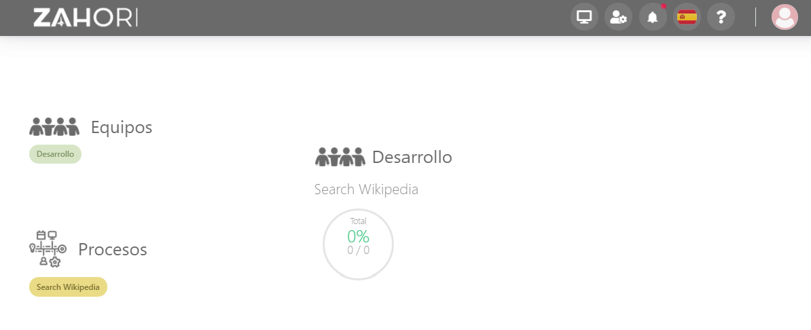

### 4. Descarga el **proceso de ejemplo**

- Usando git:

        git clone https://github.com/zahori-io/zahori-process.git

- O descargando directamente el proyecto desde GitHub:
        [Descargar proyecto](https://github.com/zahori-io/zahori-process/archive/refs/heads/master.zip)
        
### 5. **Iniciar el proceso** de ejemplo

Abre una consola y sitúate dentro de la carpeta raíz del proyecto "zahori-process".

A continuación ejecuta el siguiente comando según tu sistema operativo:
    
Windows:

    start_process.bat

Linux y Mac: 

    ./start_process.sh

Cuando el proceso termine de arrancar, verás en la consola algo similar a esto:

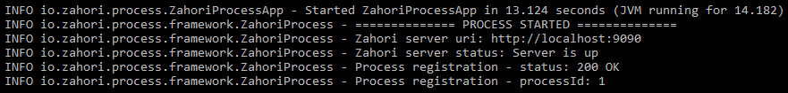

Esto quiere decir que nuestro proceso de ejemplo "Search Wikipedia" está listo para recibir de nuevas ejecuciones desde el frontal web.

### 6. **Ejecutar el proceso**

Al ejecutar el proceso de ejemplo, cargará la página web wikipedia.org y realizará una búsqueda de las palabras y en el idioma que hayamos definido en los diferentes casos de prueba. Existen 4 casos de prueba predefinidos, más adelante veremos cómo podemos modificarlos, eliminarlos o crear nuevos.

Para ejecutar el proceso:

**6.1**  En el frontal web de Zahorí, **selecciona el proceso de ejemplo "Search Wikipedia"** que se muestra en el dashboard principal:

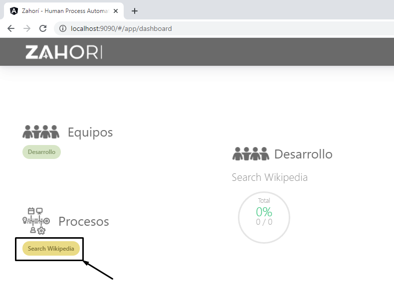

**6.2 Accede a la página "Disparador"**

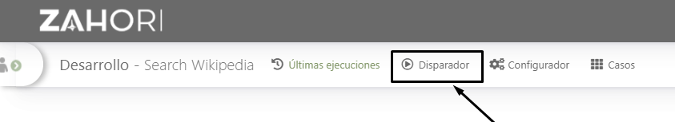

**6.3 Ejecutar el proceso**

- Selecciona en la parte izquierda los casos que quieres ejecutar (uno o varios).
- Da un nombre a tu ejecución para después distinguirla entre otras
- Selecciona la configuración por defecto "Config example" (más adelante veremos qué son y cómo se definen).
- Selecciona los navegadores en los que se ejecutará el proceso.
- Pulsa el botón "Crear" para iniciar la ejecución.

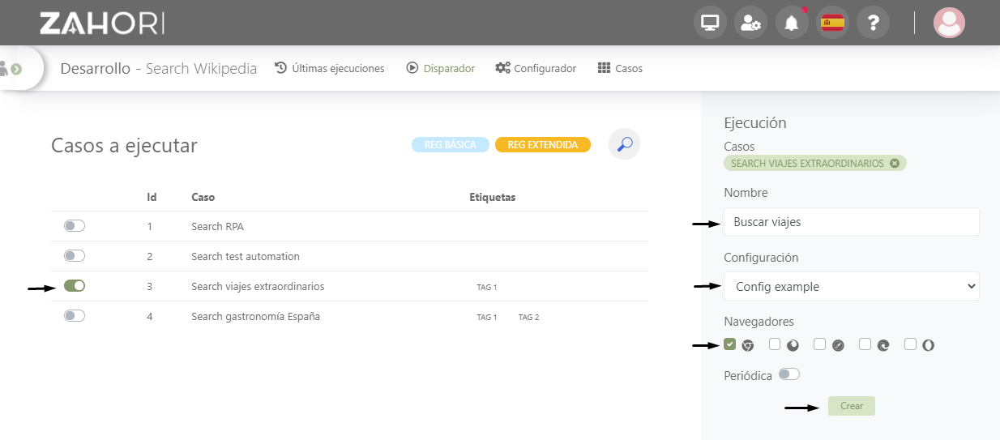

**6.4 Ver el proceso en ejecución**

Para ver que el proceso ha comenzado a ejecutarse accede a la página "Últimas Ejecuciones"

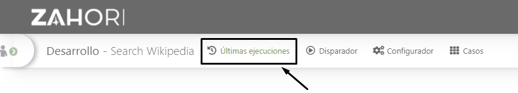

Verás que se ha creado una nueva ejecución:

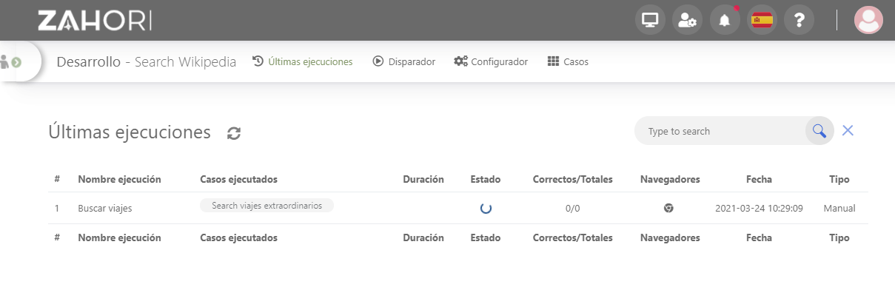

Si seleccionas la ejecución haciendo click sobre ella, podrás ver el detalle de los casos que se van a ejecutar, el estado actual... incluso ver la ejecución en tiempo real en el navegador! (botón "Ver" de la columna Vídeo/Streaming)

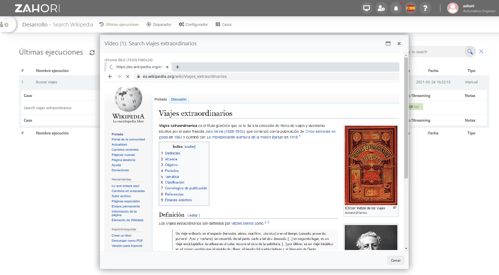

**6.5 Resultados y evidencias**

Una vez que el proceso ha terminado puedes revisar los resultados y evidencias de la ejecución recargando la página "Últimas ejecuciones". Puedes recargarla pulsando sobre el icono recargar (a futuro la recarga será automática en tiempo real ;). 

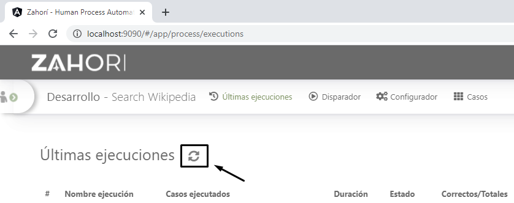

Selecciona la fila de la ejecución para ver los casos ejecutados y sus resultados.

Para ver el detalle y las evidencias de un caso pulsa el botón "Ver" de la columna "Evidencias"

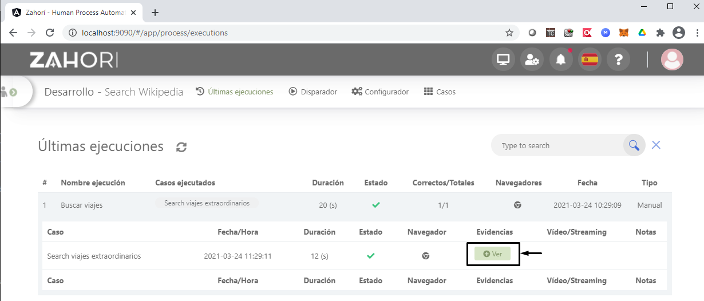

Se abrirá un panel lateral donde se pueden ver todas las evidencias generadas para ese caso: los pasos ejecutados, las capturas de pantallas, el log de bajo nivel, etc...

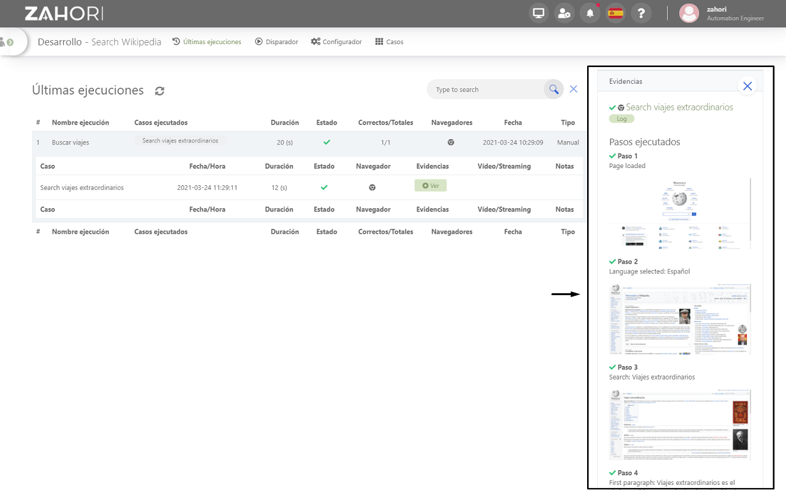

### 7. **Parar el servidor**

Para parar el servidor puedes hacerlo de varias formas:
- Cerrando la consola desde la que se inició.
- Pulsando las teclas "Ctrl + c" en la consola desde la que se inició.
- O ejecutando, dentro de la carpeta "zahori-server", el siguiente fichero
    
    Windows:
    > stop_server.bat

    Linux y Mac:
    > ./stop_server.sh

### 8. **Parar el proceso**

Para parar el proceso también puedes hacerlo de varias formas:
- Cerrando la ventana de la consola del proceso.
- Pulsando las teclas "Ctrl + c" en la consola del proceso.

## Configura el entorno de desarrollo
Para empezar a desarrollar tus propias automatizaciones con Zahorí necesitarás un IDE que te permita desarrollar en Java.
A continuación te dejamos algunas guías de instalación de los IDEs más conocidos y cómo importar el proceso de ejemplo para empezar a crear tu propia automatización.
- [Instalar y configurar IntelliJ Idea en Windows 10](https://github.com/zahori-io/zahori-doc/blob/main/installation-guides/IDEs/Installation-IntelliJ-Idea-Windows-ES.adoc)
- [Instalar y configurar IntelliJ Idea en Ubuntu](https://github.com/zahori-io/zahori-doc/blob/main/installation-guides/IDEs/Installation-IntelliJ-Idea-Ubuntu-ES.adoc)
- Próximamente... Eclipse
